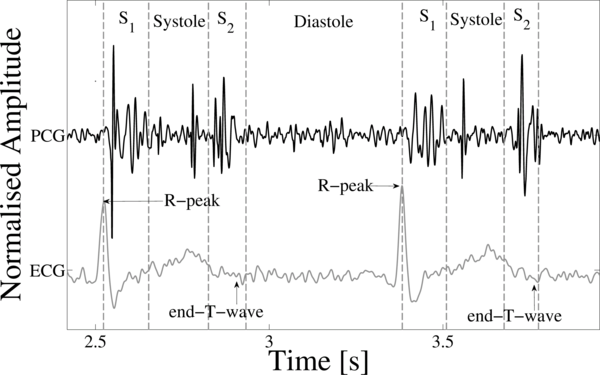

# Κατάτμηση PCG δειγμάτων με matlab

Για να κάνουμε την κατάτμηση των PCG δειγμάτων όπως φαίνεται στην εικόνα
χρησιμοποιήσουμε των αλγόριθμο του Springer τον οποίο τον παρείχε ο διαγωνισμός
στους συμμετέχοντες. Ωστόσο δεν θα χρησιμοποιήσουμε όλα τα δεδομένα που μας
δίνει ο αλγόριθμος, αλλά αυτό που θα κάνουμε είναι να βρίσκουμε που ξεκινάει το
πρώτο S1 και στη συνέχεια θα αναλύουμε τα 3 επόμενα δευτερόλεπτα. Αυτή η
διαδικασία θα γίνεται ώστε τα δείγματα με τα οποία θα εκπαιδεύσουμε το
νευρονικό δίκτυο να είναι “ευθυγραμισμένα” μεταξύ τους.

Μέσω της συνάρτησης [generateS1Files](./generateS1Files.m) δημιουργούμε το
αρχείο [s1.csv](./s1.csv) που περιέχει το σημείο σε milliseconds που βρίσκεται
το πρώτο S1 για όλα τα δείγματα PCG.

Όλα τα δείγματα βρίσκονται στην σελίδα της physionet
[εδώ](https://physionet.org/files/challenge-2016/1.0.0/training.zip).
